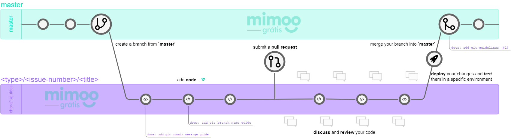

# Mimoo's Git Workflow Guideline

- Start Date: 2019-09-19
- Version: 0.1.0-DRAFT

## Summary

Inspired by [GitHub Workflow](https://guides.github.com/introduction/flow).

## Table of Contents

- [Overview](#overview)
- [Branch Naming Guide](#branch-naming-guide)
- [Pull Request](#pull-request)

## Vocabulary

The wording of each guideline indicates the strength of the rule and the key world "MUST", "MUST NOT", "REQUIRED", "SHALL", "SHALL NOT", "SHOULD", "SHOULD NOT", "RECOMMENDED", "MAY" AND "OPTIONAL" in this document are to be interpreted as described in [RF 2119](https://www.ietf.org/rfc/rfc2119.txt).

## Overview

## Branch Naming Guide

The following guide is a lightweight convention on top of branch naming. It help developers to drive in a standardized way. [read more ...](./branch-naming-guide.md)

## Pull Request

Fill the `PR Checklist` section in [pull-request.sample.md template](./pull-request.sample.md) for PR.